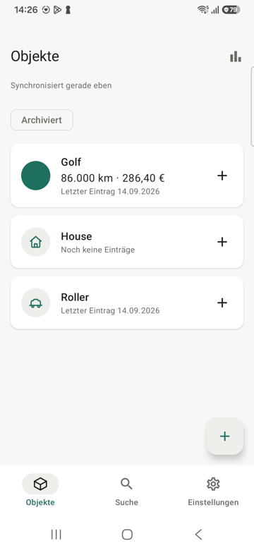
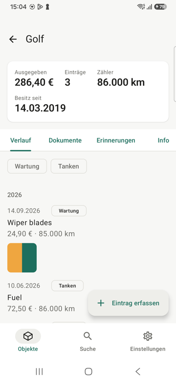
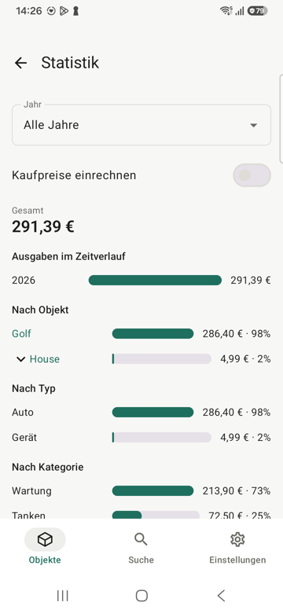
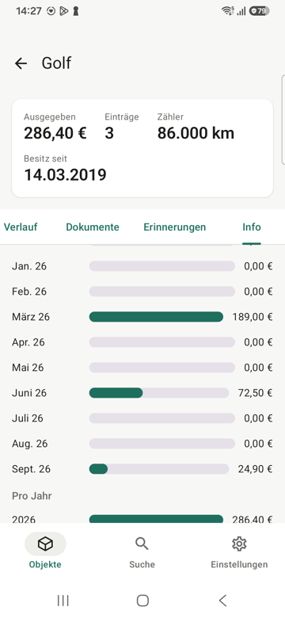
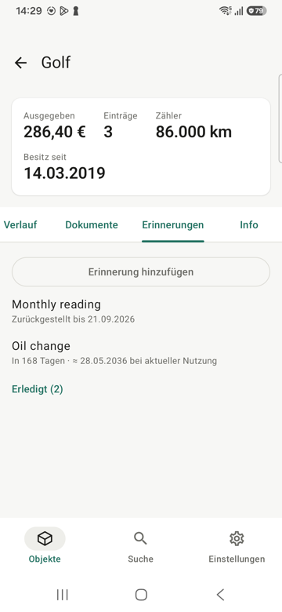
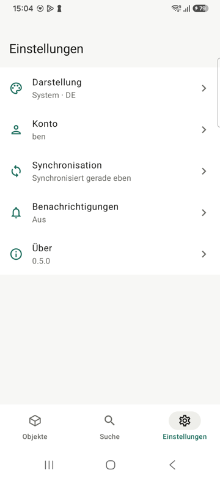
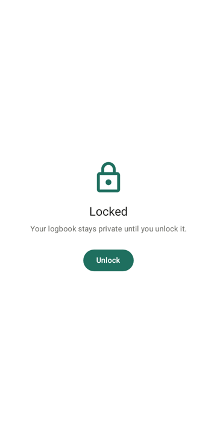

# LogB for Android

Native, offline-first Android client for [LogB](https://github.com/13/logb): the complete history
of your owned objects, on your phone, readable with the radio off, reconciled with your
self-hosted server in the background.

**Status: all six phases built; feature parity with the web client for a signed-in person.** Sign in, everything the account owns lands on the phone and
stays readable offline; objects, entries, readings and reminders can be created, edited,
deleted, marked done and snoozed with the radio off, and reconcile with the server -- and with
edits made in the browser -- under field-level last-write-wins when a connection returns. Photos
and documents work in both directions: taken, picked or shared into an entry offline and
uploaded later; the server's files mirrored as thumbnails always and originals within a budget.
Statistics (spend over time, by object tree, by type, by category, with a year picker) and every
object's insights (cost of ownership, spend per month, cost per km, fuel consumption, usage,
consumption per fill) are computed on the phone from the mirror, and reminders with a counter
target show when recent usage will reach it. A daily notification summarises what is due, an
optional biometric or screen-lock gate covers the logbook, and launcher shortcuts jump to the
due list, search and a new object. The objects list searches every depth and sorts five ways,
readings warn when they jump far beyond recent usage, a due reminder can be skipped by its own
interval, entries born offline say so until they are sent, and an object can be exported as the
server's zip through the share sheet. Only operator screens stay in the browser: people, API
tokens, the database, instance settings and whole-instance import.

<p>




</p>
<p>



</p>

## Requirements

- A LogB server at 0.7.1 or newer with the `server_time` millisecond fix (logb branch
  `server-time-millis`): the four sync additions from 0.7.0 (`client_uuid` on creates,
  `client_uuid` in responses, `entity_id` on pull rows, logged reference cleanups) plus
  millisecond `server_time`, which offline edits made right after a create depend on.
- Android 9 or newer.

## Build

Gradle 9.7 / AGP 9.3 / Kotlin 2.4 on JDK 21. `gradle.properties` pins the JDK path of the
development machine; put the SDK path in `local.properties` (`sdk.dir=/home/ben/Android/Sdk`).

```bash
./gradlew :app:testDebugUnitTest :app:lintDebug :app:assembleDebug
adb install -r app/build/outputs/apk/debug/app-debug.apk
```

A server on the development machine is reachable from the phone through
`adb reverse tcp:8090 tcp:8090` as `http://localhost:8090`; the network security config allows
cleartext only for `localhost` and `10.0.2.2`.

## Release builds

`./gradlew :app:assembleRelease` signs with the key named by `ANDROID_KEYSTORE`,
`ANDROID_KEYSTORE_PASS`, `ANDROID_KEY_ALIAS` and `ANDROID_KEY_PASS` in the environment (or an
untracked `keystore/keystore.properties` with `storeFile`, `storePassword`, `keyAlias`,
`keyPassword`); without either it signs with the debug key. `-PversionName=0.5.0
-PversionCode=500` stamp a version; the About screen shows the commit the build came from.

The release workflow (`.github/workflows/release.yml`) builds a tagged `v*` push into a signed
APK attached to a GitHub release, reading the keystore from the `LOGB_KEYSTORE_BASE64`,
`LOGB_KEYSTORE_PASSWORD`, `LOGB_KEY_ALIAS` and `LOGB_KEY_PASSWORD` secrets. CI
(`.github/workflows/ci.yml`) runs the unit tests, lint, the screenshot goldens, both APKs, and
the contract test against a `13/logb` checkout built beside the app.

## Tests

- Unit tests (JVM, Room on Robolectric's SQLite, MockWebServer): `./gradlew :app:testDebugUnitTest`
- Contract test against a real server binary:
  `./gradlew :app:testDebugUnitTest -PlogbBin=$HOME/repo/logb/target/release/logb --tests '*SyncContractTest'`
- Screenshot goldens (Roborazzi, both themes): `./gradlew :app:verifyRoborazziDebug`; re-record
  deliberately with `:app:recordRoborazziDebug` and look at every PNG under `app/src/test/screenshots/`.
- Instrumented (a device or emulator): `./gradlew :app:connectedDebugAndroidTest`
- By hand: `docs/smoke-checklist.md`.

`tools/seed-server.py` seeds a fresh server with the tree the bootstrap fixture came from.

## Design

- `docs/superpowers/specs/2026-09-14-logb-android-design.md` — architecture, sync rules, screens, phases.
- `docs/superpowers/plans/` — phase 0 (server additions), phases 1–6 (this app), each with a status header.

Stack: Kotlin, Jetpack Compose (Material 3), Room, Retrofit + OkHttp, WorkManager, DataStore,
Hilt, Coil.
